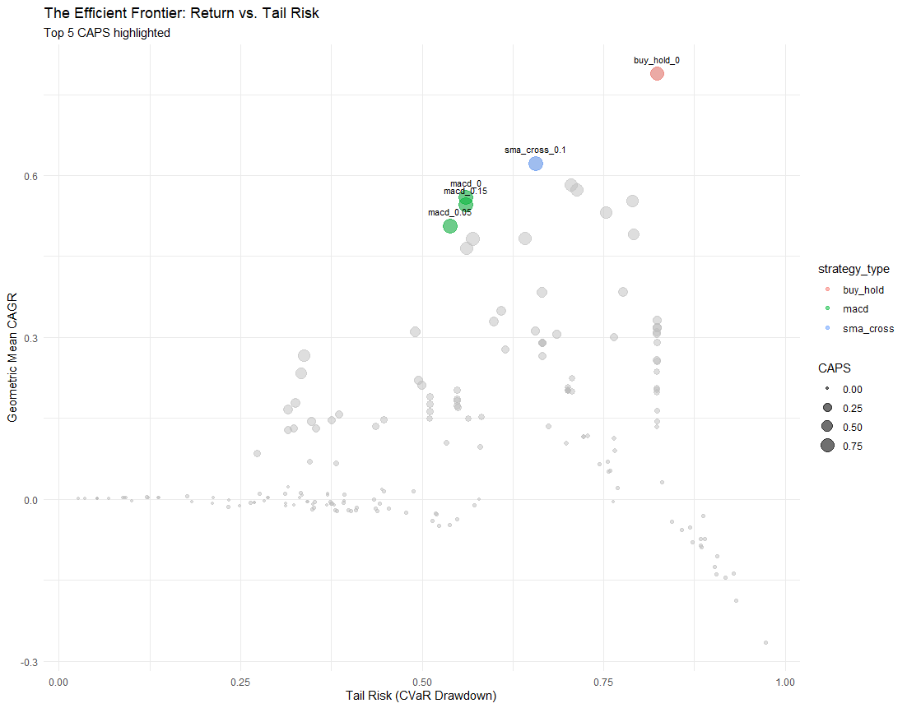

Welcome to the first entry in a multi-part series where I document the journey of building a fully automated, production-grade cryptocurrency trading system from scratch using R, primarily focussed on BTC-AUD.

Before we write a single line of execution code or connect to an exchange API, we have to answer the most important question in quantitative finance: **Does this strategy actually work, or is it just a fluke of historical noise?**

## The Philosophy: Survival of the Fittest

Many beginners pick one strategy (like an SMA Cross), run it on one year of Bitcoin data, and if the "line goes up," they go live. This is a recipe for disaster.

In this project, we utilise a **Monte Carlo Windowing** approach. If you find the term "Monte Carlo" a bit too "Wall Street," think of it this way:

> Imagine 1,000 different traders all trading BTC-AUD, with a starting initial of \$1,000 each. Each trader starts at a completely different point in time and trades for a different length of duration. Now, imagine every single one of those 1,000 traders is testing all 8 of our algorithms across every possible stop-loss setting.

By doing this, we aren't just testing if a strategy works "on average"; we are testing if it survives in the hands of the "unlucky" trader who started right before a crash, or the "impatient" trader who only stayed in the market for three months. This allows us to see the **distribution of outcomes** across thousands of different market regimes.

## The Candidates: The Algorithms Under the Microscope

To find our "Champion" strategy, we are testing a diverse range of algorithmic approaches. Each is designed to handle price action differently, from simple trend following to complex volatility-normalised momentum.

1.  Buy and Hold (The Benchmark)\
    This is our baseline. It involves buying the asset at the start of the window and holding it until the end, regardless of price fluctuations. Any strategy we build must significantly outperform this after accounting for risk and fees to be considered viable.

2.  SMA (The Simple Trend Follower)\
    The Simple Moving Average (SMA) is a pure trend-following strategy.

    -   The Signal: We buy when the price moves above the SMA and sell when it drops below.
    -   The Goal: Detect trend direction changes early. It performs beautifully in trending markets but can suffer from "whipsaws" during sideways movement.

3.  SMA Crossover (The Dual-Window Filter)\
    This variant uses two SMAs: a "Fast" (short-term) and a "Slow" (long-term).

    -   The Signal: We buy when the Fast SMA crosses above the Slow SMA (a Golden Cross) and sell when it falls below.
    -   The Goal: By using a second average as a filter, we aim to ignore minor price noise and capture the "meat" of a larger trend.

4.  RSI (The Momentum Gauge)\
    The Relative Strength Index (RSI) measures the speed and change of price movements, ranging from 0 to 100.

    -   The Signal: We buy when RSI recovers from an "oversold" state (below 30) and sell when it retreats from an "overbought" state (above 70).
    -   The Goal: To identify exhausted price moves and profit from mean reversion or momentum shifts.

5.  Bollinger Bands (The Volatility Envelope)\
    Bollinger Bands track volatility by placing bands at a set number of standard deviations away from a moving average. -The Signal: We buy when the price drops below the lower band (oversold) and sell when it breaches the upper band (overbought).

    -   The Signal: We buy when the price drops below the lower band (oversold) and sell when it breaches the upper band (overbought).
    -   The Goal: To trade the "rebound" when prices reach extreme statistical dispersals.

6.  MACD (The Momentum Oscillator)\
    The Moving Average Convergence Divergence (MACD) tracks the relationship between two exponential moving averages.

    -   The Signal: We buy when the MACD line crosses above its Signal line (the zero-crossover of the histogram).
    -   The Goal: To catch momentum shifts faster than simple SMAs. While responsive, it can produce false breakouts during high-volatility periods.

7.  MACD-V (The Volatility-Normalised Hybrid)\
    [Authored by Alex Spiroglou](https://papers.ssrn.com/sol3/papers.cfm?abstract_id=4099617), MACD-V normalises the MACD line by dividing it by the Average True Range (ATR).

    -   The Signal: It uses fixed "strength thresholds" (±50). We trade only when the momentum is within specific zones.
    -   The Goal: To transform raw momentum into "relative momentum," making the indicator more robust across different volatility regimes.

8.  MACD-V Dynamic (The Adaptive Strategy)\
    This is an evolution of the MACD-V that replaces fixed thresholds with adaptive ones based on rolling quantiles.

    -   The Signal: Signals are only executed if the current momentum is in the top 20% of recent histogram values.
    -   The Goal: To filter out low-conviction signals and only enter trades when the market exhibits historically significant strength.

## Tuning the Machine: The Parameters

An algorithm is only as good as its settings. In our backtesting engine, we don't just test the logic; we test the parameters that define the strategy's "personality".

A strategy with a "short" lookback period is aggressive and twitchy - it catches moves early but gets fooled by noise. A "long" lookback is conservative and smooth - it stays in trends longer but reacts slowly to sudden crashes.

For this project, we explored a massive parameter grid:

-   **Lookback Periods**: Ranging from short-term bursts (12–14 periods) to long-term foundations (250 periods for SMAs).

-   **Thresholds**: The RSI 30/70 bands and the MACD-V "Strength Threshold" of 50.

-   **Statistical Deviations**: The standard deviation multiplier (usually 2.0) for Bollinger Bands.

-   **Adaptive Quantiles**: In the Dynamic MACD-V, we utilise an 80% quantile over a 20-period rolling window to ensure we only act on the most significant momentum.

-   **Stop Losses**: Every algorithm is being tested with no stop loss, and also with the following: 2%, 5%, 10% and 20%.

Finding the "Goldilocks" zone - where the parameters are sensitive enough to profit but robust enough to survive - is the primary goal of this entire simulation.

## Technical Challenge: The Memory Wall

When running 185,000+ backtest permutations (Strategies x Parameters x Windows), R users often hit a "Memory Wall". Storing every trade and equity curve for every simulation can easily exceed 64GB of RAM.

To solve this, I implemented a "Chunked Parallel" architecture. We process one stop-loss setting at a time, parallelise the backtests within that chunk, summarise the results into tiny performance metrics, and then aggressively clear the memory.

Example:

```{r eval=FALSE}
# The 'Memory-Safe' Loop Pattern
for (sl in stop_losses) {
  message("Starting Monte Carlo for Stop Loss: ", sl * 100, "%")
  
  # 1. Parallel execution of backtests for this specific chunk
  results_chunk <- future_pmap(mc_param_grid_sl, backtest_worker_function)
  
  # 2. Extract metrics (reduces data size by 99%)
  summary_chunk <- get_performance_metrics(results_chunk, initial_equity = 1000)
  
  # 3. Store the small summary and PURGE the large results object
  all_summaries[[paste0("SL", sl)]] <- summary_chunk
  
  # CRITICAL: Clear the massive result list and call garbage collector
  rm(results_chunk)
  gc(verbose = FALSE) 
}
```

## Measuring Success: The CAPS Score

Total return (CAGR) is a "vanity metric". If a strategy makes 100% return but has an 80% drawdown, most traders will quit long before they see the profit.

To find the truly "robust" strategy, I developed the Calmar-adjusted Probability Score (CAPS). It is a weighted average of:

1.  Geometric Mean CAGR: How much we actually make.

2.  Win Rate (by Window): How often the strategy is profitable across different time periods.

3.  Median Sharpe Ratio: Risk-adjusted consistency.

4.  CVaR Drawdown: The "Tail Risk" (the average of the worst-case drawdowns).

The purpose of this metric is to penalise high risk, high reward strategies (like Buy & Hold) and, at the same time, reward strategies that effectively manage downside risk and maintain consistency.

## Visualising the Efficient Frontier

By plotting our Tail Risk against our Return, we can see the "Efficient Frontier". We are ideally looking for strategies in the top-left corner: high returns with low tail risk.

However, a word of realism: In practice, it is incredibly rare to find a strategy that sits comfortably in that top-left corner. Finance is a game of trade-offs; usually, the strategies with the highest returns come with a "stinging" tail risk, while the safest strategies often barely beat the bank's interest rate. Our goal isn't necessarily to find a "magic bullet," but to find the strategy that pushes the boundary of what is statistically possible.

To make the chart more intuitive, we map the point size to the CAPS Score - the bigger the bubble, the more robust the strategy.



Here is the output for the top 5 (by CAPS) algorithms:  

```{r echo=FALSE, eval=TRUE}
ranked_summary <- structure(list(strategy_type = c("sma_cross", "macd", "macd", 
"macd", "buy_hold", "macd"), stop_loss = c(0.1, 0, 0.15, 0.05, 
0, 0.02), geo_mean_CAGR = c(0.622003173915044, 0.559153133989876, 
0.545858516880031, 0.506255423733825, 0.788926794107977, 0.48295021662684
), win_rate_windows = c(0.971, 0.978, 0.975, 0.981, 0.979, 0.988
), median_Sharpe = c(0.9987, 0.93535, 0.92975, 0.93435, 0.85025, 
0.94685), cvar_drawdown = c(0.657136, 0.5611, 0.5611, 0.5391, 
0.8232, 0.569642), n_samples = c(1000L, 1000L, 1000L, 1000L, 
1000L, 1000L), robust_calmar = c(0.946536445903198, 0.996530269096196, 
0.972836422883677, 0.939075169233583, 0.958365882055366, 0.847813568218003
), prob_score = c(0.9697377, 0.9147723, 0.90650625, 0.91659735, 
0.83239475, 0.9354878), CAPS = c(0.917892076016341, 0.911598286280747, 
0.881882297571696, 0.860753811570304, 0.797738728802005, 0.793119249742409
)), row.names = c(NA, -6L), class = c("tbl_df", "tbl", "data.frame"
))

knitr::kable(ranked_summary)
```
  
Based on the table above, we can conclude SMA Crossover with a 10% stop loss is the most suitable strategy that is consistent, and manages both risk and return well.

## What's Next?
We now have a trading strategy.  

In Part 2, we will dive into creating a trading bot: moving from historical data to live trading data.

Stay tuned—the maths is done, now it is time to build the machine.